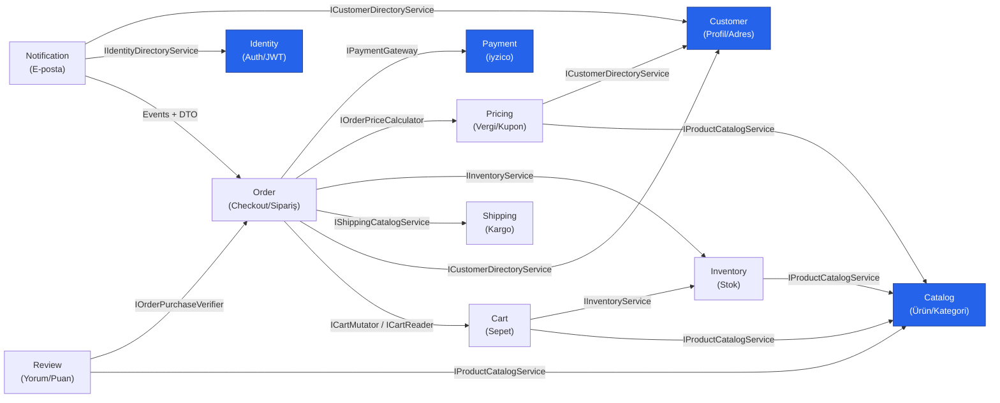
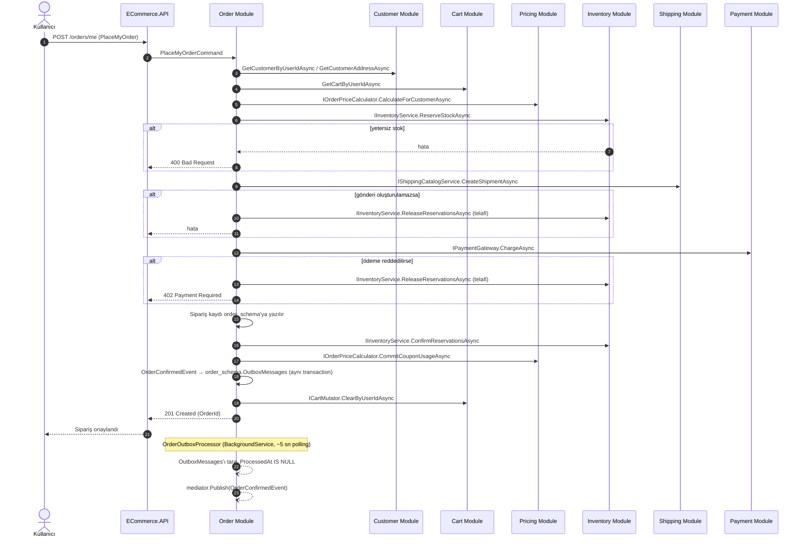
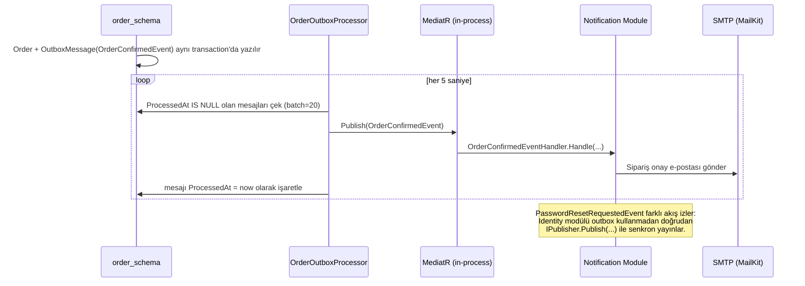

# VBT-Commerce — Backend

Tek mağazalı (single-store) bir e-ticaret platformunun backend'i. **.NET 10 / ASP.NET Core Web API** üzerinde, **Modular Monolith** mimarisiyle, **Domain-Driven Design** ve **CQRS** prensipleriyle geliştiriliyor. Uygulama tek bir process olarak deploy edilir; ancak içindeki 11 modül birbirinden net sınırlarla (yalnızca `Contracts` üzerinden) ayrılmıştır — ileride gerekirse bağımsız servislere bölünebilecek şekilde tasarlanmıştır.

> Bu doküman `backend/docs/` altındaki tasarım dokümanlarının (`architecture.md`, `project-overview.md`, `auth-and-authorization.md`) güncel kod tabanıyla karşılaştırılarak çıkarılmış özetidir.

---

## 1. Teknoloji Yığını

| Katman | Teknoloji |
|---|---|
| Runtime / Framework | .NET 10, ASP.NET Core Web API |
| Mimari | Modular Monolith + DDD + CQRS |
| Mediator | MediatR (Pipeline Behaviors ile) |
| Validasyon | FluentValidation |
| ORM / Veritabanı | Entity Framework Core → **SQL Server** (tek fiziksel DB, modül başına ayrı schema) |
| Kimlik doğrulama | Custom JWT (Access + Refresh Token), BCrypt.Net-Next ile parola hash'leme |
| Ödeme | Iyzipay SDK (iyzico sandbox) |
| E-posta | MailKit (SMTP) |
| API dokümantasyonu | `Microsoft.AspNetCore.OpenApi` + Scalar (`/scalar`, sadece Development ortamında) |
| Arka plan işleri | `BackgroundService` (Outbox processor, polling tabanlı) |

Mesaj kuyruğu (RabbitMQ/Kafka/MassTransit vb.) bilinçli olarak **kullanılmıyor** — modüller aynı process içinde çalıştığı için MediatR'ın in-process `Publish`/`Send` mekanizması yeterli görülmüş.

---

## 2. Katmanlı Modül Yapısı

Her modül aynı 4 katmanlı şablonu izler:

```
Modules/<ModuleName>/
├── <Module>.Domain/          Entity, Value Object, Domain Exception — dış bağımlılık yok
├── <Module>.Application/     Command/Query/Handler (CQRS), Behaviors, Integrations arayüzleri
├── <Module>.Contracts/       Modülün DIŞARI açtığı arayüz + DTO'lar (diğer modüller sadece buna bağımlı olur)
└── <Module>.Infrastructure/  EF Core DbContext + Migrations, Contracts'ın implementasyonu, dış servis entegrasyonları (SMTP, iyzico...)
```

Bağımlılık yönü her zaman: `Infrastructure → Application → Domain`, `Contracts → Domain`. Bir modül **başka bir modülün DbContext'ine, repository'sine veya Application katmanına asla doğrudan erişmez**; yalnızca o modülün `Contracts` projesindeki arayüzler (ör. `ICustomerDirectoryService`, `IProductCatalogService`, `IInventoryService`, `IOrderPriceCalculator`, `IPaymentGateway`) üzerinden konuşur. Bu kural kod tabanının tamamında **denetlenmiş ve zorlanmıştır** — hiçbir modül başka bir modülün `Application` projesine `ProjectReference` vermez.

Tüketen taraf, dış modülün `Contracts`'ını doğrudan kullanmak yerine kendi `Application` katmanında ince bir adapter arayüzü (`Integrations/`) tanımlar; bu arayüz o modülün kendi `Infrastructure`'ında, dış modülün `Contracts`'ına adapte edilerek implemente edilir (ör. `Order.Application.Integrations.IInventoryIntegrationService` → `Order.Infrastructure`'da `Inventory.Contracts.IInventoryService`'e sarmalanır). Bu, tüketen modülün Application katmanının başka bir modülün DTO/tip isimlerine doğrudan bağımlı olmasını azaltır.

### 11 Modül

| # | Modül | Sorumluluk |
|---|---|---|
| 1 | **Identity** | Kayıt/giriş, JWT access+refresh token, Google OAuth, şifre sıfırlama |
| 2 | **Catalog** | Ürün, kategori, varyant, görsel, attribute yönetimi |
| 3 | **Customer** | Müşteri profili, adresler, misafir (guest) müşteri kaydı |
| 4 | **Inventory** | Stok takibi ve rezervasyon (senkron kontrol + `ExpiresAt` güvenlik ağı) |
| 5 | **Cart** | Sepet ve sepet kalemi yönetimi (üye + anonim sepet) |
| 6 | **Pricing** | Vergi hesaplama, kupon/indirim sistemi, fiyat hesaplama motoru |
| 7 | **Shipping** | Kargo firması yönetimi (MVP'de manuel/statik), gönderi ve teslimat durumu |
| 8 | **Payment** | iyzico entegrasyonu, ödeme/iade işlemleri |
| 9 | **Order** | Sipariş oluşturma (checkout saga'sı), durum yönetimi |
| 10 | **Review** | Sadece satın almış kullanıcıların yazabildiği ürün yorum/puanı (moderasyonsuz, anında yayın) |
| 11 | **Notification** | E-posta bildirimleri (Outbox/Event tetiklemeli) |

`BuildingBlocks.Domain` ve `BuildingBlocks.Application` projeleri modüller arası ortak altyapıyı taşır: `DomainException`, `ICommand<T>`/`IQuery<T>` marker arayüzleri, `ICurrentUserService`, ve 4 pipeline behavior.

---

## 3. Veritabanı

Tek fiziksel SQL Server veritabanı, **modül başına ayrı schema** (11 schema, her modülün kendi EF Core migration geçmişi var):

```
identity_schema · catalog_schema · customer_schema · inventory_schema · cart_schema
pricing_schema · shipping_schema · payment_schema · order_schema · review_schema · notification_schema
```

Her modül yalnızca kendi `DbContext`'ini yönetir; modüller arası paylaşılan transaction (TransactionScope) **kullanılmaz** — her Command kendi modülünün transaction'ı içinde çalışır (bkz. §5).

---

## 4. CQRS + Pipeline Behaviors

Command/Query'ler `ICommand<T>` / `IQuery<T>` marker arayüzleriyle işaretlenir ve MediatR handler'ları tarafından işlenir. Her request, `Program.cs`'de tanımlı sabit bir behavior zincirinden geçer:

```
İstek
  │
  ▼
1. LoggingBehavior            → request/response'u loglar
  ▼
2. ExceptionHandlingBehavior  → hatayı loglayıp yeniden fırlatır (yutmaz)
  ▼
3. ValidationBehavior         → FluentValidation validator'larını çalıştırır
  ▼
4. AuthorizationBehavior      → IRequireRole işaretli request'lerde rol kontrolü yapar
  ▼
5. TransactionBehavior (modül-özel) → sadece ICommand için, tek modülün DbContext'inde transaction açar
  ▼
6. Handler                    → asıl iş mantığı
  ▼
Yanıt
```

`TransactionBehavior` her modül için ayrı ayrı kayıtlıdır (`Identity.Application.Behaviors.TransactionBehavior<,>`, `Catalog.Application.Behaviors.TransactionBehavior<,>` …) ve kapsamı **her zaman tek modülle sınırlıdır** — modüller arası ortak bir transaction hiçbir zaman açılmaz.

---

## 5. Modüller Arası Tutarlılık: Hibrit Yaklaşım

Kritik olmayan senaryolarda gecikmeye tolerans olduğu için tek bir strateji yerine **ikili bir yaklaşım** kullanılıyor:

- **Sonucun kullanıcıya anında dönmesi gerekiyor / ana işlem bu adım başarısız olursa hiç gerçekleşmemeli** → **Senkron çağrı**, her zaman hedef modülün `Contracts` arayüzü üzerinden (tüketen modülün kendi `Integrations` adapter'ı ile).
- **Gecikebilir, kritik olmayan yan etki** (e-posta gönderimi gibi) → **Outbox Pattern + Domain Event** (aynı transaction içinde outbox tablosuna yazılır, arka planda `BackgroundService` tarafından işlenir).

### 5.1. Senkron çağrılar — Order'ın checkout saga'sı

**Order** modülü, checkout sırasında beş modülü senkron olarak orkestre eder — hepsi kendi `Contracts` arayüzü üzerinden, Order'ın kendi `Integrations` adapter'larına sarmalanmış olarak:

| Adım | Hedef modül | Contract |
|---|---|---|
| Stok rezervasyonu / onay / iptal | Inventory | `IInventoryService` |
| Gönderi oluşturma | Shipping | `IShippingCatalogService.CreateShipmentAsync` |
| Fiyat/vergi hesaplama + kupon kullanımı | Pricing | `IOrderPriceCalculator` |
| Ödeme çekme / iade | Payment | `IPaymentGateway` |
| Sepet temizleme | Cart | `ICartMutator` |

`IPaymentGateway`, iyzico'ya özgü hiçbir tip taşımaz (`PaymentCardInfo`/`PaymentBuyerInfo`/`PaymentAddressInfo`/`PaymentBasketItem` — nötr DTO'lar); Order, ödeme sağlayıcısının iyzico olduğunu hiçbir zaman bilmez. Bu, Identity modülünün Google OAuth token'ını diğer modüllere hiç sızdırmama prensibiyle aynı mantığı izler.

Bu beş `Contracts` arayüzünün implementasyonu, ilgili modülün kendi `Infrastructure` katmanında, kendi `ISender`'ı ile kendi `Application`'ındaki Command/Query'lere delege eder (ör. `Inventory.Infrastructure.InventoryService` → `sender.Send(new ReserveStockCommand(...))`). Yani modül sınırını geçen tek şey tip/arayüzdür; MediatR command'ları hiçbir zaman modül dışına sızmaz.

### 5.2. Outbox Pattern + Event

```
1. OrderModule (aynı transaction içinde):
     INSERT order_schema.Orders (...)
     INSERT order_schema.OutboxMessages (OrderConfirmedEvent)
   COMMIT

2. OrderOutboxProcessor (BackgroundService, 5 sn'lik polling, batch=20):
     order_schema.OutboxMessages tablosunu tarar (ProcessedAt IS NULL)
     Her mesaj için mediator.Publish(domainEvent)  ← in-process dispatch
     Mesajı ProcessedAt = now olarak işaretler

3. NotificationModule (INotificationHandler<OrderConfirmedEvent>):
     Sipariş onay e-postasını gönderir (MailKit / SMTP)
```

Şu an outbox işleyicisi yalnızca **Order** modülünde var (`OrderOutboxProcessor`). **Identity** modülü ise `PasswordResetRequestedEvent`'i outbox'a yazmadan, `ForgotPasswordCommandHandler` içinde doğrudan `IPublisher.Publish(...)` ile senkron olarak yayınlıyor — tasarım dokümanındaki genel outbox kuralından ayrılan, gerçek kodda gözlemlenen bir istisna.

### 5.3. Telafi Edici Aksiyon (Compensating Action)

Checkout saga'sı sırasında bir adım başarısız olursa önceki adımlar geri alınır (`IInventoryService.ReleaseReservationsAsync`, `IPaymentGateway.RefundAsync`). Ayrıca rollback çağrısının kendisi de başarısız olursa diye stok rezervasyonlarında bir `ExpiresAt` alanı bulunur — müsait stok sorgusu süresi geçmiş rezervasyonları otomatik hariç tutar, ayrı bir temizlik servisi gerektirmez.

---

## 6. Kimlik Doğrulama & Yetkilendirme (özet)

- **Access Token:** Stateless JWT, 15 dk ömürlü, `sub`/`email`/`role`/`exp` claim'leri.
- **Refresh Token:** `identity_schema.RefreshTokens` tablosunda hash'lenmiş halde saklanır, rotation uygulanır (`ReplacedByTokenId` zinciri), platform bazlı ayrı oturum zinciri (`FamilyId`) — Web 7 gün, Mobile 30 gün.
- Eşzamanlı refresh isteklerinde tutarsızlığı önlemek için `IMemoryCache` + `SemaphoreSlim` ile **kullanıcı+platform bazlı dinamik kilit** kullanılır.
- **2 rol:** `Customer`, `Admin`. Rol kontrolü `IRequireRole` arayüzü + `AuthorizationBehavior` ile merkezi olarak uygulanır.
- Google ile giriş desteklenir; Google'ın kendi token'ı hiçbir zaman frontend/mobile'a sızmaz, sadece kimlik doğrulama adımında kullanılıp sistemin kendi JWT'sine dönüştürülür — diğer modüller yalnızca sistemin JWT'sini tanır.
- Şifre sıfırlama (forgot/reset password) e-posta ile gerçek teslimat üzerinden çalışır (MailKit/SMTP), token'lar `identity_schema`'da saklanır.
- Diğer modüller kullanıcı kimliğine `ICurrentUserService` (`BuildingBlocks.Application.Security`) üzerinden erişir; JWT doğrulaması HTTP middleware katmanında yapılır.

Detaylar için `backend/docs/auth-and-authorization.md`.

---

## 7. API Yüzeyi

`ECommerce.API` projesi tüm modüllerin controller'larını barındırır (`Controllers/Auth`, `Controllers/Catalog`, `Controllers/Carts`, `Controllers/Customers`, `Controllers/Inventory`, `Controllers/Orders`, `Controllers/Payments`, `Controllers/Pricing`, `Controllers/Reviews`, `Controllers/Shipping`, `Controllers/Notifications`). Controller'lar iş mantığı içermez — sadece HTTP request'i ilgili Command/Query'e çevirip `IMediator`'a gönderir.

- **Development ortamında:** `/scalar` üzerinden interaktif API dokümantasyonu, uygulama açılışında `DevelopmentDataSeeder` ile örnek Admin/Customer hesabı seed'i.
- **CORS:** `Cors:AllowedOrigins` konfigürasyonundan okunur, `AllowCredentials` açık (Web refresh-token akışı cookie'ye dayanıyor).
- **Reverse proxy desteği:** `ForwardedHeaders` (X-Forwarded-For/Proto) yapılandırılmış — TLS'i sonlandıran bir proxy arkasında da `Request.IsHttps` doğru okunuyor.
- **Hata yönetimi:** `GlobalExceptionHandler` (`IExceptionHandler`), 25+ domain exception tipini uygun HTTP status koduna (400/401/402/403/404/502/500) çevirip RFC 7807 `ProblemDetails` formatında döner.

---

## 8. Proje Kapsamı (özet)

**Dahil:** Ürün kataloğu (kategori/attribute/varyant/görsel), stok yönetimi + rezervasyon, üye/misafir kullanıcı akışı, çoklu adres, sepet, sipariş + durum takibi, vergi hesaplama, kupon/indirim (yığılabilir, kategori/ürün/sepet kapsamlı), kargo firması entegrasyonu (MVP'de manuel), iyzico sandbox ödeme, e-posta bildirimleri, sadece alıcıların yazabildiği ürün yorumları.

**Şimdilik dahil değil:** Çoklu satıcı (marketplace), SMS/push bildirim, misafir→üye dönüşüm akışı, yorum moderasyonu, çoklu para birimi/dil.

Detaylar için `backend/docs/project-overview.md`.

---

## 9. Örnek Uçtan Uca Akış (Checkout)

```
1. Kullanıcı ürünlere göz atar                         → Catalog
2. Sepete ürün ekler                                    → Cart (Catalog + Inventory'den kontrol eder)
3. Checkout başlar:
     a. Adres seçilir/girilir                           → Customer
     b. Kargo seçeneği seçilir                           → Shipping
     c. Kupon uygulanır, vergi + toplam hesaplanır        → Pricing
4. PlaceMyOrder / PlaceGuestOrder komutu çalışır          → Order, aşağıdaki saga'yı Contracts üzerinden senkron yürütür:
     4.1  Stok rezervasyonu                               → Inventory  (IInventoryService.ReserveStockAsync)
     4.2  Gönderi kaydı oluşturulur                       → Shipping   (IShippingCatalogService.CreateShipmentAsync) — başarısızsa 4.1 geri alınır
     4.3  iyzico ile ödeme çekilir                        → Payment    (IPaymentGateway.ChargeAsync) — başarısızsa 4.1 geri alınır
     4.4  Order kaydı DB'ye yazılır (order_schema)
     4.5  Rezervasyon onaylanır + kupon kullanımı işlenir  → Inventory, Pricing — OrderConfirmedEvent outbox'a yazılır
     4.6  Sepet temizlenir                                 → Cart       (ICartMutator.ClearByUserIdAsync)
5. OrderOutboxProcessor (arka planda, ~5 sn'de bir) OrderConfirmedEvent'i yayınlar
     → Notification, sipariş onay e-postasını gönderir (MailKit/SMTP)
6. Teslimat süreci ilerledikçe sipariş durumu ilgili kişi tarafından manuel güncellenir
7. Teslimattan sonra satın alan kullanıcı ürüne yorum/puan bırakabilir → Review (Order'a satın alma doğrulaması için sorar)
```

Bu akışın tamamı (başarılı ödeme, ödeme reddi + rollback, checkout anında yetersiz stok, onaylanmış siparişi iptal + refund, misafir checkout) gerçek bir SQL Server + iyzico sandbox + SMTP ile uçtan uca manuel olarak doğrulanmıştır.

---

## 10. Modüller Arası İletişim Diyagramı

### 10.1. Statik Bağımlılık Grafiği (derleme zamanı — yalnızca `Contracts` referansları)

Identity, Catalog, Customer ve Payment "çekirdek" modüllerdir — hiçbiri başka bir modülün Contracts'ına bağımlı değildir, yalnızca kendi Contracts'larını dışarı açarlar. **Order dahil hiçbir modül, başka bir modülün `Application` projesine referans vermez** — tüm oklar tek tip: `Contracts`.



Her ok, tüketen modülün `Infrastructure`/`Application` katmanının, hedef modülün `Contracts` projesine verdiği bir referansı temsil eder — hiçbiri hedefin `Application` projesine dokunmaz. Bu, `backend/docs/module-boundary-refactor-plan.md`'de tarif edilen denetim + refactor planının tamamlanmış hâlidir (bkz. o doküman, tarihsel kayıt olarak).

### 10.2. Checkout Saga — Sıra (Sequence) Diyagramı

`PlaceMyOrderCommandHandler` + `OrderOperations.PlaceOrderAsync` akışının çalışma zamanı görünümü — her ok, hedef modülün `Contracts` arayüzü üzerinden gider:



### 10.3. Asenkron Event Akışı (Outbox → Notification)



---

## 11. Dizin Yapısı (özet)

```
backend/
├── docs/                          Mimari/kapsam/auth tasarım dokümanları + modül-sınırı refactor kaydı
└── src/
    ├── BuildingBlocks/
    │   ├── BuildingBlocks.Domain/         DomainException
    │   └── BuildingBlocks.Application/    ICommand/IQuery, 4 Pipeline Behavior, ICurrentUserService
    ├── ECommerce.API/                     Controllers, Program.cs, Middleware, Seed, Security
    └── Modules/
        ├── Identity/  Catalog/  Customer/  Inventory/  Cart/
        └── Pricing/   Shipping/ Payment/   Order/       Review/  Notification/
            (her biri Domain / Application / Contracts / Infrastructure)
```

---

## 12. Çalıştırma (yerel geliştirme)

1. SQL Server erişimi + `appsettings.Development.Local.json` içinde `ConnectionStrings:DefaultConnection`, `Jwt:SigningKey`, `Iyzico:ApiKey/SecretKey`, `Smtp:*` gibi gizli değerleri tanımlayın (bu dosya `appsettings.Development.json`'ın üzerine opsiyonel olarak yüklenir, repo'ya commit edilmez — `.gitignore`'da `appsettings.*.Local.json`).
2. `dotnet run --project backend/src/ECommerce.API` — açılışta her modülün bekleyen migration'ları otomatik uygulanır (`DatabaseMigrationExtensions.MigrateModuleDatabasesAsync`, bkz. `WebApplicationExtensions.cs`), elle `dotnet ef database update` çalıştırmaya gerek yok. Development ortamında `/scalar` üzerinden API dokümantasyonuna erişilebilir, açılışta örnek Admin/Customer hesabı otomatik seed edilir.

---

## 13. Production Dağıtımı (Docker)

Sunucuda `api`, `mssql` ve `seq` (log görüntüleme) üç ayrı container olarak, tek `docker-compose.yml` ile çalışır.

1. `backend/.env.example` dosyasını `backend/.env` olarak kopyalayıp gerçek değerleri gir (bu dosya commit edilmez).
2. `docker compose up -d --build` — üç servisi de build edip ayağa kaldırır. Migration'lar API açılışında otomatik uygulanır (bkz. §12, adım 2) — yeni bir migration içeren bir sürümü deploy ettiğinde bile elle bir şey çalıştırman gerekmez, container her başladığında bekleyen migration'ları kendisi uygular.
3. Sadece API kodu değiştiğinde `mssql`'i etkilememek için `docker compose up -d --build api` kullan (bkz. yukarıdaki soru-cevap) — `mssql` ve `seq` servis tanımları değişmediği sürece dokunulmaz, veri (`mssql-data`/`seq-data` volume'leri) kalıcıdır.
4. Loglar `Production` ortamında Console + rolling file'a ek olarak Seq'e de akar (`appsettings.Production.json`) — migration uygulamaları da (`Applying migration '...'.`) dahil. Seq UI varsayılan olarak yalnızca `127.0.0.1:15341`'e bağlanır (dışa kapalı; 5341 değil — bazı geliştirici makinelerinde zaten native bir Seq servisi o portu kullanıyor olabilir); sunucudan uzaktan bakmak için SSH tunnel kullan: `ssh -L 15341:localhost:15341 user@sunucu` ve tarayıcıda `http://localhost:15341` aç, `admin` / `.env`'deki `SEQ_ADMIN_PASSWORD` ile giriş yap. Genel internete açacaksan önce bir reverse proxy'nin arkasına al.
5. `Cors:AllowedOrigins` (`appsettings.Production.json`), takım arkadaşlarının local dev sunucularının (`localhost:3000/5173/8081/19006`) prod'daki API'ye tarayıcıdan istek atabilmesi için önceden eklenmiştir — mobil geliştirme CORS'tan etkilenmez, native HTTP client'lar origin kontrolüne tabi değildir. Gerçek bir domain alındığında o origin'i (`https://...`) aynı diziye ekleyip `docker compose up -d --build api` ile yeniden başlat.

