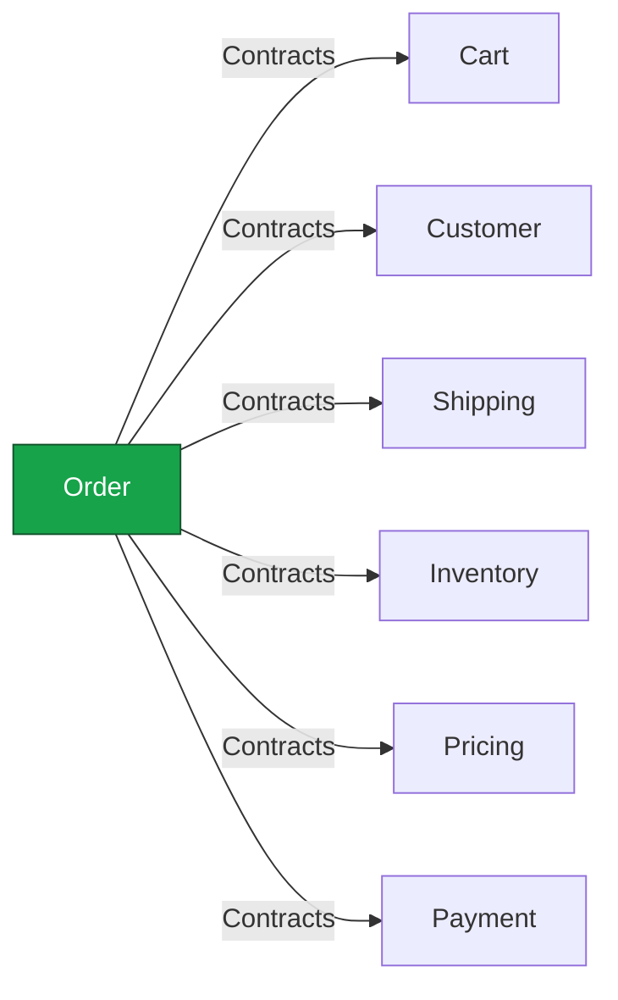

# Modüller Arası Sınır İhlalleri — Bulgular ve Refactor Planı

## 0. Amaç

`architecture.md` §3'te tanımlı kural net: **"Modules communicate with each other not directly, but through contracts."** Bir modül başka bir modülün DbContext'ine, repository'sine **veya Application katmanına** doğrudan erişmemeli; yalnızca o modülün `Contracts` projesi (+ kendi tanımladığı `Integrations` adaptörü) üzerinden konuşmalı.

Bu doküman, kod tabanının tamamının bu kurala göre denetlenmesinin sonucudur: hangi modüllerin temiz olduğu, hangi dosyalarda ihlal olduğu, ve bunları kurala uygun hale getirecek adım adım refactor planı.

---

## 1. Metodoloji

Her modülün 4 katmanı (`Domain/Application/Contracts/Infrastructure`) için `.csproj` dosyalarındaki `<ProjectReference>` girdileri çıkarıldı, ardından her cross-module referansın hedefinin `Contracts` mi yoksa `Application`/`Domain` mi olduğu tek tek işaretlendi. Ardından şüpheli dosyalardaki `using` ifadeleri ve gerçek çağrı siteleri (`ISender.Send(...)`) okunarak ihlaller doğrulandı.

---

## 2. Sonuç Özeti

| Modül | Dışa bağımlılığı | Durum |
|---|---|---|
| Identity | yok | ✅ Temiz (çekirdek modül) |
| Catalog | yok | ✅ Temiz (çekirdek modül) |
| Customer | yok | ✅ Temiz (çekirdek modül) |
| Payment | yok (dışa çağrı yapmıyor, sadece çağrılıyor) | ✅ Temiz ama **Contracts'ı boş** — bkz. §3.6 |
| Cart | → `Catalog.Contracts`, `Inventory.Contracts` | ✅ Temiz |
| Inventory | → `Catalog.Contracts` | ✅ Temiz |
| Pricing | → `Catalog.Contracts`, `Customer.Contracts` | ✅ Temiz |
| Shipping | dışa bağımlılığı yok | ✅ Temiz |
| Review | → `Catalog.Contracts`, `Order.Contracts` | ✅ Temiz |
| Notification | → `Order.Contracts`, `Identity.Contracts`, `Customer.Contracts` | ✅ Temiz |
| **Order** | → `Cart.Contracts`, `Customer.Contracts`, `Shipping.Contracts` (temiz) **+ `Cart.Application`, `Inventory.Application`, `Pricing.Application`, `Shipping.Application`, `Payment.Application` (İHLAL)** | ❌ **Tek ihlal kaynağı** |

**Sonuç: 11 modülden 10'u kurala tam uyumlu. Tüm ihlaller `Order.Application` içinde, 3 dosyada toplanmış:**
- `Order.Application/Commands/Checkout/PlaceMyOrder/PlaceMyOrderCommandHandler.cs`
- `Order.Application/Commands/Checkout/PlaceGuestOrder/PlaceGuestOrderCommandHandler.cs`
- `Order.Application/Services/OrderOperations.cs`

Bu iyi haber: sorun dağınık değil, tek bir modülün tek bir sorumluluğunda (checkout saga orkestrasyonu) yoğunlaşmış.

---

## 3. Detaylı İhlal Envanteri

### 3.1. Inventory — 3 çağrı, Contracts karşılığı hazır

```csharp
sender.Send(new ReserveStockCommand(orderId, reserveItems))
sender.Send(new ConfirmReservationsByReferenceCommand(order.Id))
sender.Send(new ReleaseReservationsByReferenceCommand(orderId))
```

`Inventory.Contracts.IInventoryService` bu üç işlemi **birebir** karşılıyor (`ReserveStockAsync`, `ConfirmReservationsAsync`, `ReleaseReservationsAsync`) ve implementasyonu da zaten `Inventory.Infrastructure/Integrations/InventoryService.cs`'de mevcut. **Hiçbir yeni Contracts/Infrastructure kodu gerekmiyor** — sadece Order tarafında kullanılması yeterli.

> Not: `ReserveStockCommand`/`Confirm.../Release...` kayıtları kasıtlı olarak `IRequireRole` taşımıyor — kod içi yorumda "meant to be called in-process by other modules" yazıyor. Yani bu commandlar zaten "modüller arası çağrı" için tasarlanmış; sadece doğru katmandan (Contracts) çağrılmıyorlar.

### 3.2. Cart — sepet temizleme, Contracts'ta yok

```csharp
sender.Send(new ClearMyCartCommand())              // PlaceMyOrderCommandHandler
sender.Send(new ClearAnonymousCartCommand(anonId))  // PlaceGuestOrderCommandHandler
```

`Cart.Contracts.ICartReader` sadece okuma yapıyor (`GetCartByUserIdAsync`, `GetCartByAnonymousIdAsync`) — yazma metodu yok.

**Önemli nüans:** `ClearMyCartCommand`'ın `IRequireRole` var ve `UserId`'yi parametre olarak almıyor — handler'ı `ICurrentUserService.UserId` üzerinden **ambient (dolaylı) kullanıcı bağlamına** güveniyor. Bu, `ClearAnonymousCartCommand`'ın açık `AnonymousId` alıp `IRequireRole` taşımamasıyla tam tersi bir tasarım. Yeni Contracts metodunu tasarlarken `ClearMyCartCommand`'ı olduğu gibi sarmalamak yerine, **`ClearAnonymousCartCommand` ile aynı deseni** izleyip açık `UserId` alan, `IRequireRole` taşımayan yeni bir "in-process" command eklemek daha doğru (bkz. §4.2).

### 3.3. Shipping — gönderi oluşturma, Contracts'ta yok

```csharp
sender.Send(new CreateShipmentCommand(orderId, shippingCompanyId))
```

`Shipping.Contracts.IShippingCatalogService` sadece kargo firması sorgulama yapıyor. `CreateShipmentCommand`'ın kendi kod yorumu zaten şunu söylüyor: *"the future Order module will call this in-process"* — yani bu command da baştan modüller arası çağrı için tasarlanmış, sadece doğru katmandan geçmiyor.

### 3.4. Pricing — sipariş fiyatlama + kupon kullanımı, Contracts'ta yok

```csharp
sender.Send(new CalculateMyOrderPriceQuery(items, couponCodes))          // PlaceMyOrder
sender.Send(new CalculateGuestOrderPriceQuery(guestId, items, coupons))  // PlaceGuestOrder
sender.Send(new CommitCouponUsageCommand(appliedCoupons, userId, guestId, orderId))
```

`Pricing.Contracts.IPriceCatalogService` sadece tekil ürün fiyatı sorguluyor (`GetPriceAsync`/`GetPricesAsync`) — sipariş bazlı vergi+kupon hesaplaması ya da kupon kullanım kaydı için hiçbir şey yok. Ayrıca dönen/giden tipler (`PriceCalculationItem`, `PriceCalculationResultDto`, `AppliedCouponDto`) şu an `Pricing.Application.Common` içinde — bunlar aslında public şekil taşıyor, yeri `Pricing.Contracts` olmalı.

**Aynı ambient-user nüansı burada da var:** `CalculateMyOrderPriceQueryHandler` içeriden `currentUserService.UserId` okuyor (`PricingOwnerKey.ForCustomer(currentUserService.UserId!.Value)`), `CalculateGuestOrderPriceQuery` ise açık `GuestCustomerId` alıyor. Yeni Contracts metodu `CalculateGuestOrderPriceQuery` deseninde, **açık `Guid? userId, Guid? guestCustomerId`** almalı — ambient context'e güvenmemeli (bkz. §4.4).

### 3.5. Payment — en derin ihlal

```csharp
sender.Send(new ChargeOrderPaymentCommand(orderId, basketTotal, paidTotal, card, buyer, address, basketItems))
sender.Send(new RefundOrderPaymentCommand(orderId, ip))
```

Sadece command çağrısı değil — `Order.Application`, `Payment.Application.Gateway` namespace'inden **iyzico'ya özgü DTO'ları** (`IyzicoCardInfo`, `IyzicoBuyerInfo`, `IyzicoAddressInfo`, `IyzicoBasketItem`) doğrudan `new` ile inşa ediyor. Yani Order, "ödeme sağlayıcısı iyzico" bilgisini biliyor — tıpkı `auth-and-authorization.md`'de kaçınılması gereken örnek gibi ("Google'ın token'ı diğer modüllere asla sızmaz" prensibiyle doğrudan çelişiyor).

**`Payment.Contracts` projesinde tek bir dosya bile yok.** Bu modülün hiç dışa açılmış bir sözleşmesi yok — Order'ın başka seçeneği olmadığı için doğrudan Application'a girmiş.

### 3.6. Domain enum sızıntıları (yan etki)

`Order.Application`, yukarıdaki `*.Application` referansları üzerinden **transitive olarak** şu Domain enum'larına da erişebiliyor: `Cart.Domain.Enums.CartItemType`, `Inventory.Domain.Enums.InventoryItemType`, `Pricing.Domain.Enums.PriceItemType`. Bunlar handler'larda `Order.Domain.Enums.OrderItemType`'a manuel `switch` ile map ediliyor (`MapToInventoryItemType`, `MapToPriceItemType`, `MapToOrderItemType`). §5'teki Application referansları kaldırıldığında bu sızıntı otomatik olarak kapanır; mapping mantığı adaptör implementasyonlarına taşınmalı.

---

## 4. Hedef Mimari ve Şablon

Kod tabanında zaten **doğru** uygulanmış iki örnek var — yeni kod bunları birebir taklit edecek:

- `Cart.Infrastructure/Integrations/InventoryIntegrationService.cs` → `Cart.Application.Integrations.IInventoryIntegrationService`'i, `Inventory.Contracts.IInventoryService`'e adapte ediyor.
- `Inventory.Infrastructure/Integrations/CatalogIntegrationService.cs` → `Inventory.Application.Integrations.ICatalogIntegrationService`'i, `Catalog.Contracts.IProductCatalogService`'e adapte ediyor.

Şablon her zaman 3 parça:

```
[Tüketen Modül].Application/Integrations/I<Hedef>IntegrationService.cs   ← tüketicinin kendi ihtiyacına göre tanımladığı ince arayüz
                    │ implemente eder
[Tüketen Modül].Infrastructure/Integrations/<Hedef>IntegrationService.cs ← [Hedef].Contracts'a adapte eder
                    │ çağırır
[Hedef Modül].Contracts/I<Hedef>Service.cs                                ← hedefin dışa açtığı sözleşme
                    │ implemente eder
[Hedef Modül].Infrastructure/Integrations/<Hedef>Service.cs               ← kendi ISender'ıyla kendi Application'ına delege eder
                    │ çağırır
[Hedef Modül].Application/Commands|Queries/.../Handler.cs                 ← asıl iş mantığı
```

---

## 5. Faz Faz Refactor Planı

### Faz 1 — Inventory *(risk: çok düşük, yeni Contracts kodu gerekmiyor)*

1. `Order.Application/Integrations/IInventoryIntegrationService.cs` ekle:
   ```csharp
   public interface IInventoryIntegrationService
   {
       Task ReserveStockAsync(Guid referenceId, IReadOnlyCollection<ReserveStockLineItem> items, CancellationToken ct);
       Task ConfirmReservationsAsync(Guid referenceId, CancellationToken ct);
       Task ReleaseReservationsAsync(Guid referenceId, CancellationToken ct);
   }
   ```
   (`ReserveStockLineItem` yerine Order'ın kendi tipini kullan; adaptör Inventory.Contracts'ın `ReserveStockItemRequest`'ine map etsin.)
2. `Order.Infrastructure/Integrations/InventoryIntegrationService.cs` ekle → `Inventory.Contracts.IInventoryService`'e adapte et.
3. `Order.Application.csproj`: `Inventory.Application` referansını sil, `Inventory.Contracts` ekle. `Order.Infrastructure.csproj`'a da `Inventory.Contracts` ekle.
4. `OrderOperations.cs`'de 3 çağrı noktasını güncelle, `InventoryItemType` mapping'ini adaptöre taşı.

### Faz 2 — Cart *(risk: düşük)*

1. `Cart.Application`'da `IRequireRole` taşımayan, açık parametreli yeni command: `ClearCartByUserIdCommand(Guid UserId) : ICommand<Unit>` (mevcut `ClearAnonymousCartCommand` deseniyle simetrik) — handler'ı mevcut clear-cart iş mantığını çağırsın.
2. `Cart.Contracts`'a `ICartMutator` (veya `ICartReader`'ı genişlet) ekle: `ClearByUserIdAsync(Guid userId, ct)`, `ClearByAnonymousIdAsync(Guid anonymousId, ct)`.
3. `Cart.Infrastructure`'da implemente et — `ClearByAnonymousIdAsync` zaten var olan `ClearAnonymousCartCommand`'a, `ClearByUserIdAsync` yeni `ClearCartByUserIdCommand`'a delege etsin.
4. Order tarafında `ICartIntegrationService`'i (mevcut dosya, şu an sadece okuma var) bu iki metotla genişlet, `Order.Infrastructure/Integrations/CartIntegrationService.cs`'i güncelle.
5. `Order.Application.csproj`'dan `Cart.Application` referansını sil (`Cart.Contracts` zaten var).

### Faz 3 — Shipping *(risk: düşük)*

1. `Shipping.Contracts`'a ekle: `Task<Guid> CreateShipmentAsync(Guid orderId, Guid shippingCompanyId, CancellationToken ct)` (mevcut `IShippingCatalogService`'e ekle ya da yeni `IShipmentService` aç — tercihe bağlı, mevcut arayüzü genişletmek daha az dosya).
2. `Shipping.Infrastructure`'da implemente et → `sender.Send(new CreateShipmentCommand(...))`.
3. Order'ın mevcut `IShippingIntegrationService`'ine `CreateShipmentAsync` ekle, adaptörü güncelle.
4. `Order.Application.csproj`'dan `Shipping.Application` referansını sil.

### Faz 4 — Pricing *(risk: orta — DTO taşıma işi var)*

1. `PriceCalculationItem`, `PriceCalculationResultDto`, `PriceCalculationLineDto`, `AppliedCouponDto` tiplerini `Pricing.Application.Common`'dan `Pricing.Contracts`'a taşı (bunlar zaten dışa açık şekil taşıyor). `Pricing.Application` içindeki kullanım yerlerini `using Pricing.Contracts;` ile güncelle.
2. `Pricing.Application`'da, ambient-user'a güvenmeyen, açık parametreli yeni bir sorgu ekle (ör. `CalculateOrderPriceQuery(Guid? UserId, Guid? GuestCustomerId, items, couponCodes)`) — ya da mevcut `CalculateGuestOrderPriceQuery`'yi `Guid? CustomerId` alacak şekilde genelleştirip `CalculateMyOrderPriceQuery`'yi sadece HTTP controller'ın kullandığı ince bir wrapper'a indirgemek de bir seçenek.
3. `Pricing.Contracts`'a `IPriceCalculationService.CalculateOrderPriceAsync(...)` ve `.CommitCouponUsageAsync(appliedCoupons, userId, guestCustomerId, orderId, ct)` ekle.
4. `Pricing.Infrastructure`'da implemente et.
5. `Order.Application/Integrations/IPricingIntegrationService.cs` ekle + `Order.Infrastructure`'da adaptör.
6. `Order.Application.csproj`'dan `Pricing.Application` referansını sil.

### Faz 5 — Payment *(risk: en yüksek — Contracts sıfırdan)*

1. `Payment.Contracts`'a **nötr** (sağlayıcıdan bağımsız) DTO'lar tanımla: `PaymentCardInfo`, `PaymentBuyerInfo`, `PaymentAddressInfo`, `PaymentBasketItem` — isimlerinde "Iyzico" geçmesin (Identity'nin Google token'ını gizlemesiyle aynı prensip).
2. `Payment.Contracts`'a `IPaymentGateway` ekle: `Task<Guid> ChargeAsync(Guid orderId, decimal basketTotal, decimal paidTotal, PaymentCardInfo card, PaymentBuyerInfo buyer, PaymentAddressInfo address, IReadOnlyCollection<PaymentBasketItem> items, ct)`, `Task RefundAsync(Guid orderId, string ip, ct)`.
3. `Payment.Infrastructure`'da implemente et → `sender.Send(new ChargeOrderPaymentCommand(...))` / `RefundOrderPaymentCommand`, gelen nötr DTO'ları burada `Iyzico*` tiplerine map et (iyzico'ya özgü bilgi artık sadece Payment modülünün içinde kalır).
4. `Order.Application/Integrations/IPaymentIntegrationService.cs` ekle (Order'ın kendi DTO'larıyla) + `Order.Infrastructure`'da adaptör.
5. `Order.Application.csproj`'dan `Payment.Application` referansını sil, `Payment.Contracts` ekle.

### Faz 6 — Temizlik ve Doğrulama

1. `OrderOperations.cs`, `PlaceMyOrderCommandHandler.cs`, `PlaceGuestOrderCommandHandler.cs`'den `ISender sender` parametresini tamamen kaldır (artık hiçbir çağrı kalmadı).
2. `Order.Application.csproj`'da geriye sadece `Order.Domain`, `Order.Contracts`, `BuildingBlocks.Application`, `Cart.Contracts`, `Customer.Contracts`, `Shipping.Contracts`, `Inventory.Contracts`, `Pricing.Contracts`, `Payment.Contracts` kalmalı — hiçbir `*.Application` yok.
3. `dotnet build backend/src/ECommerce.API` — hem derlemenin geçtiğini hem de transitive Domain enum sızıntılarının (Cart/Inventory/Pricing.Domain) gerçekten kapandığını doğrula (derleyici artık o tiplere erişilemediğini söylemeli, mapping kodu adaptörlerde kalmalı).
4. Otomatik test projesi yok — `ECommerce.API.http` / Scalar üzerinden checkout akışını (`PlaceMyOrder`, `PlaceGuestOrder`, başarısız stok/ödeme senaryoları, cancel/refund) manuel uçtan uca test et; özellikle telafi edici aksiyonların (`ReleaseReservationsAsync`, refund) hâlâ doğru tetiklendiğini doğrula.

---

## 6. Sıralama Önerisi ve Gerekçe

**Inventory → Cart → Shipping → Pricing → Payment** sırası öneriliyor: risk/efor artan sırada, her faz bağımsız derlenip commit edilebilir, ve erken fazlar (Inventory) sıfır yeni iş mantığı gerektirdiği için ekibin deseni içselleştirmesi için düşük riskli bir ısınma turu sağlıyor.

## 7. Refactor Sonrası Beklenen Bağımlılık Grafiği



Tüm oklar tek tip: sadece `Contracts`. `Order.Application`'ın artık hiçbir modülün `Application` projesini görmediği, `git grep "Application\.(Commands|Queries)" backend/src/Modules/Order/Order.Application` gibi bir aramanın (kendi `Order.Application.Commands/Queries` hariç) sıfır sonuç döndürmesiyle doğrulanabilir.

---

*Bu doküman, `README.md` ve `architecture.md`'de tarif edilen kuralla mevcut kod tabanı karşılaştırılarak çıkarılmıştır.*
